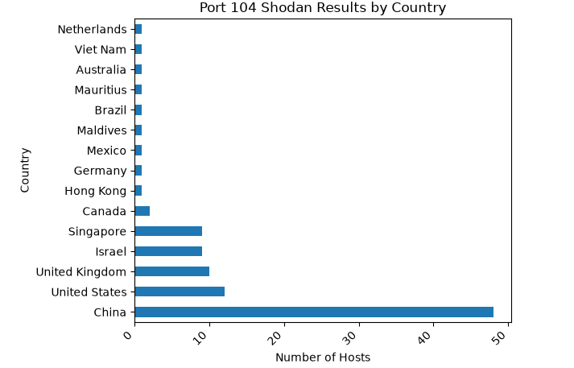
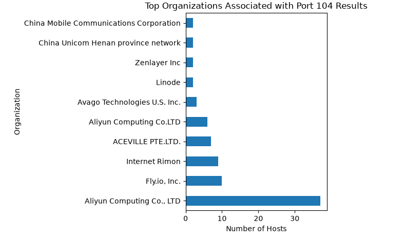

# Shodan Port 104 Analysis

Small cybersecurity project using Shodan data to look at hosts with port 104 open. Port 104 is commonly associated with DICOM, which is used for medical imaging.

## What I did

- Used the Shodan API to search port 104
- Collected country, organization, port, and timestamp data
- Removed IP addresses from the public dataset
- Used Python and pandas to analyze the results
- Used matplotlib to visualize the data

## Results

The results show which countries and organizations appeared most often in the dataset.

## Files

- `dicom_search.py` - Shodan search script
- `shodan_visualizations.ipynb` - data analysis and visualizations
- `data/port104_sanitized.csv` - dataset with IP addresses removed

## Tools

Python, Shodan API, pandas, matplotlib, Jupyter
